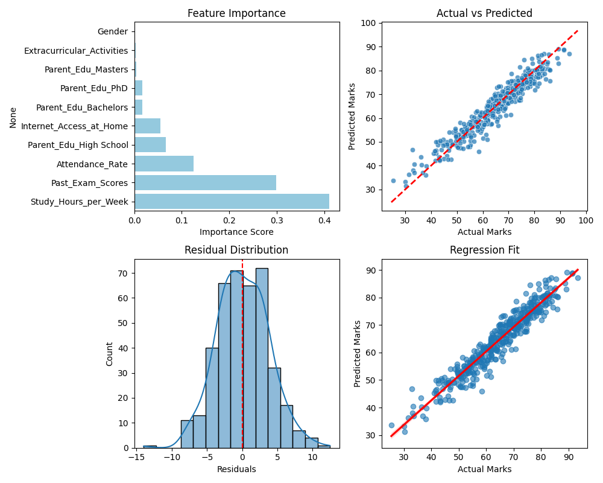
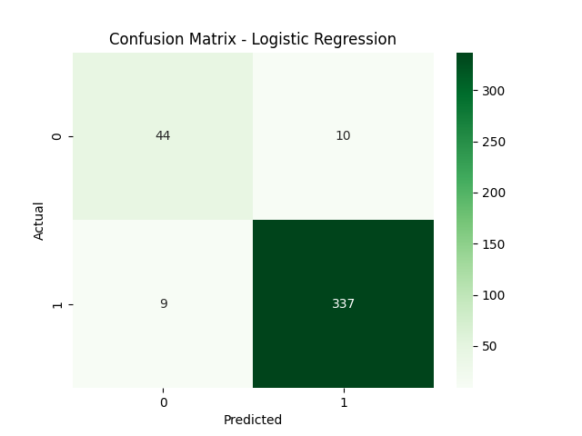

# 📚 IntelliMarks

## 📝 Project Overview

**IntelliMarks** is an AI-based system that predicts a student’s **final exam marks** and also classifies whether the student will **Pass or Fail**.  
It uses two machine learning models:

- **Random Forest Regressor** → predicts marks  
- **Logistic Regression** → predicts pass/fail outcome  

Predictions are made using key academic and personal features like study hours, attendance, past exam score, extracurricular activity, internet access, and parental education background.

The system also includes a **GenAI-based feedback module** that provides real-time suggestions to help students improve their performance.


## ✨ Features

- Predicts **final exam marks** using Random Forest Regression  
- Classifies students into **Pass / Fail** using Logistic Regression  
- Integrated **HuggingFaceModel + InferenceModel** for real-time student performance prediction  
- Key input features used:
  - Study Hours
  - Attendance %
  - Past Exam Scores
  - Internet Access (Yes/No)
  - Extracurricular Activity (Yes/No)
  - Parental Education Level
- Built-in **GenAI module** for personalized study suggestions and improvement tips  
- Clean, interactive UI for entering student details and generating results instantly  
- Helps students and educators make **data-driven decisions** with reliable predictions  


## 🛠 Tech Stack

**Frontend**
- React.js
- Axios (API communication)

**Backend**
- Python
- HuggingFaceModel + InferenceModel
- GenAI-based Feedback Generator

**Machine Learning**
- Random Forest Regressor (Marks Prediction)
- Logistic Regression (Pass/Fail Classification)
- Scikit-Learn, Pandas, NumPy


## 📊 Model Performance

### 🔷 Regression Model — Marks Prediction (Random Forest)

| Metric | Score |
|--------|--------|
| MSE | **13.61** |
| RMSE | **3.69** |
| MAE | **2.95** |
| R² Score | **0.9149** |
| Training Score | **0.9676** |
| Test Score | **0.9149** |
| Overfitting Gap | **0.0527** |

- **Predicted range:** 31.3 → 89.1  
- **Actual range:** 25.4 → 93.4  
📌 Model saved as: `regression_model.joblib`

---

### 🔶 Classification Model — Pass/Fail (Logistic Regression)

| Metric | Performance |
|--------|-------------|
| Accuracy | **90.00%** |

📌 Model saved as: `logistic_model.joblib`

## 📸 Model Prediction Output

### Regression Prediction Example


### Classification Prediction Example



## 📁 Folder Structure

```bash
Student_Performance_Prediction/
├── backend/
│   ├── app/
│   │   ├── __pycache__/                  # Auto-generated Python cache
│   │   ├── __init__.py                   # Package initializer
│   │   ├── .env                          # Environment variables (optional)
│   │   └── main.py                       # Backend entry for Uvicorn/FastAPI
│   │
│   ├── ml/
│   │   ├── clean_classification.py
│   │   ├── clean_regression.py
│   │   ├── cleaned_classification_data.xlsx
│   │   ├── cleaned_regression_dataset.xlsx
│   │   ├── high_variance_student_dataset.xlsx
│   │   ├── logistic_model.joblib         # Trained Classification Model
│   │   ├── regression_model.joblib       # Trained Regression Model
│   │   ├── synthetic.py
│   │   ├── training_classification_model.py
│   │   └── training_regression_model.py
│   │
│   ├── venv/                             # Virtual environment directory
│   └── requirements.txt
│
├── frontend/
│   ├── node_modules/                     # Auto-installed after npm install
│   ├── public/
│   ├── src/                              # React source code
│   ├── eslint.config.js
│   ├── package-lock.json
│   ├── package.json
│   ├── vite.config.js
│   ├── Figure_1.png                      # Regression prediction screenshot
│   ├── Figure_2.png                      # Classification screenshot
│   ├── README.md
│   └── Readme.md                         # (Duplicate, optional)
│
└── README.md                             # Main documentation

```

## 🔥 Installation & Setup Guide
### 1️⃣ Clone the Repository

- git clone https://github.com/KARTIKMAHNOT/Student_Performance_Prediction.git
- cd Student_Performance_Prediction

### 2️⃣  Backend Setup

**Create Virtual Environment:**
- python -m venv venv 
#### **Activate Environment:**
#### Mac/Linux
- source venv/bin/activate
#### Windows
- venv\Scripts\activate

**Install Backend Requirements:**
- cd backend
- pip install -r requirements.txt

### 3️⃣ Train Machine Learning Models
- cd ml
Run both training scripts:

- python3 training_regression_model.py
- python3 training_classification_model.py

**This will generate:**

- regression_model.joblib
- logistic_model.joblib

## 4️⃣ Run Backend Server
- cd ..
- Backend main file → backend/app/main.py
- Start backend:
- uvicorn app.main:app --reload

**Backend URL:**
👉 http://localhost:8000

## 5️⃣ Frontend Setup

Open new terminal:

- cd frontend
- npm install
- npm run dev


**Frontend URL:**
👉 http://localhost:5173


## 🚀 Future Improvements

- Add more input features such as sleep hours, study pattern, and parent income for deeper insights.
- Deploy backend + frontend on cloud (Render, Railway, AWS, Azure or GCP).
- Build a dashboard for students & teachers with historical performance graphs.
- Add user authentication & role-based access (Admin/Teacher/Student).
- Train model with larger real-world dataset for improved generalization.
- Expand model to recommend study schedules using Reinforcement Learning.
- Integrate voice-enabled feedback & chatbot assistance for student guidance.

---

## 🏁 Conclusion

**IntelliMarks** demonstrates how Artificial Intelligence can help evaluate and enhance academic performance.  
With regression for score prediction and logistic classification for pass-fail outcomes, the system offers meaningful insights using minimal input features.  

The addition of **GenAI-powered suggestions** makes this project not only predictive — but also **prescriptive**, guiding students on how to improve and perform better.  
This platform has the potential to evolve into a full academic analytics system for schools, universities, and EdTech platforms.

---

## 🪪 License

This project is **Open Source** and distributed under the **MIT License**.  
You are free to use, modify, and distribute the project with appropriate credit.

---

## 🔖 Copyright

© 2025 IntelliMarks — All rights reserved.  
Made with ❤️ by **Kartik Mahnot**.

---

## 🙌 Acknowledgements

- Scikit-Learn for ML model development  
- HuggingFace for inference integration  
- React + Streamlit for UI & deployment  
- Inspiration from EdTech learning models

---


